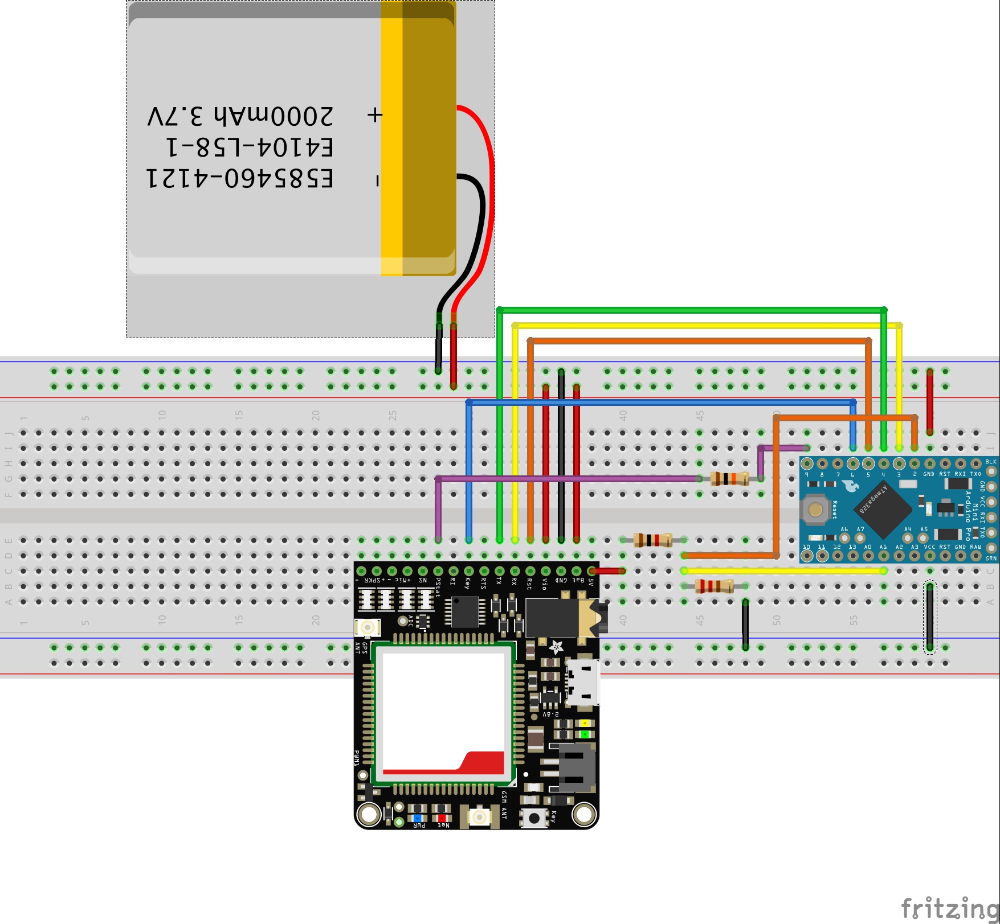
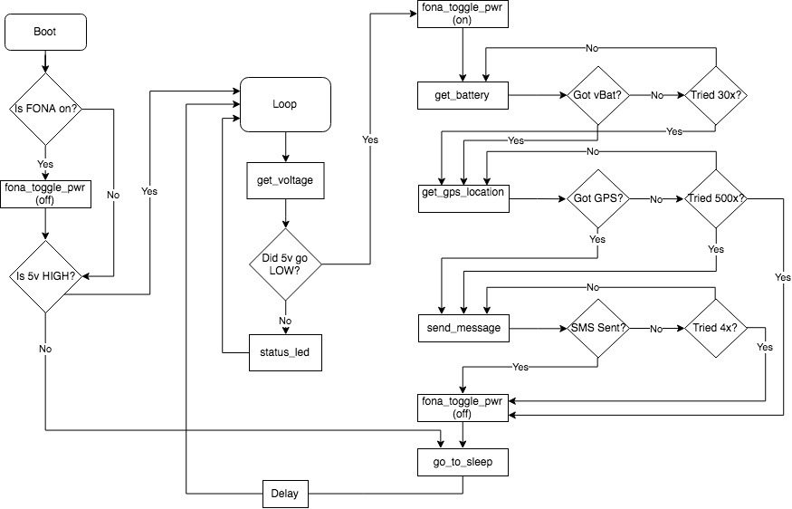

# Arduino GPS Car Tracker

## Introduction
Never forget where your car is parked again. This project combines the Adafruit Fona 808 Breakout and the compact Arduino Pro-Mini to create a low power tracking beacon which sends you the location of your car each time you park.

## Details
Adafruit's FONA 808 is a convenient partner for the Pro-Mini in this project. The 3.7V LiPo enables the Arduino to stay powered once your car turns off, and with a large enough battery, can accommodate the Arduino in power down mode for months. Using the FONA's `KEY` pin, the Arduino can completely shut down the FONA with no extra componentry needed. As opposed to using a more dispersed setup, requiring individual breakouts or components for SMS, GPS and power management, the FONA takes car of it all. 

## Configuration
In general, not much is needed after getting the project wired up. [Adafruit's FONA documentation](https://learn.adafruit.com/adafruit-fona-808-cellular-plus-gps-breakout/overview) is a good resource on getting up and running. 

## Layout

## Flow

